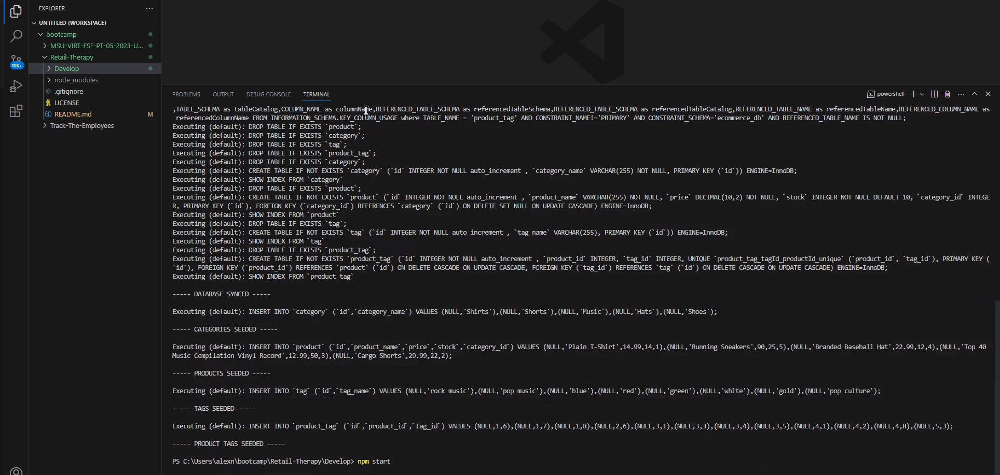
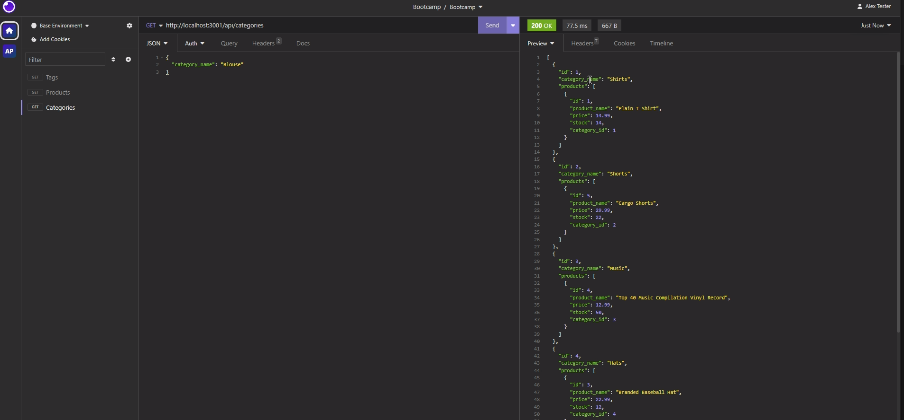

# Retail-Therapy

## License

A permissive license that allows users to do almost anything with the code as long as they provide attribution back to the author and don’t hold the author liable. This license is widely used for its simplicity and permissiveness.

## Description
Internet retail, also known as e-commerce, plays a significant role within the electronics industry, as it empowers businesses and consumers alike to conveniently engage in online buying and selling of electronic products. In the latest available data from 2021, the industry in the United States alone was estimated to have generated the substantial amount of US$2.54 trillion, according to the United Nations Conference on Trade and Development. E-commerce platforms like Shopify and WooCommerce provide a suite of services to businesses of all sizes. Due to the prevalence of these platforms, developers should understand the fundamental architecture of e-commerce sites.

VS Code Screenshot

Insomnia Screenshot

Here is a link to the live demo: 
https://drive.google.com/file/d/1DYlPRprgY_PuMeCYooaQGOx5WPXciRAd/view

## Table of Contents
- [Description](#description)
- [Installation](#installation)
- [Usage](#usage)
- [License](#license)
- [Questions](#questions)

## Installation
- This application requires Node.js, sequelize, express.js, mysql2, dotenv.

- To get started clone this repository using
https://github.com/DntTstMe/Retail-Therapy.git

- Install dependencies
npm init --y
npm install express sequelize mysql2 dotenv

- Open up MySQL shell and input
source db/schema.sql

- Then quit MySQL shell and input the following in your terminal
npm run seed
to start running application simply input
npm start

- Open up Insomnia core to GET, POST, PUT and DELETE from different routes.

## Usage
The application is used to GET data for each route(categories, products, or tags) as well as create, update, and delete data in those routes.

Here is a link to the live demo: 
https://drive.google.com/file/d/1DYlPRprgY_PuMeCYooaQGOx5WPXciRAd/view

## Questions
For any questions or concerns, please reach out to me through the following contact information:

- Github: [DntTstMe](https://github.com/DntTstMe)
- Email: lex.tester93@gmail.com